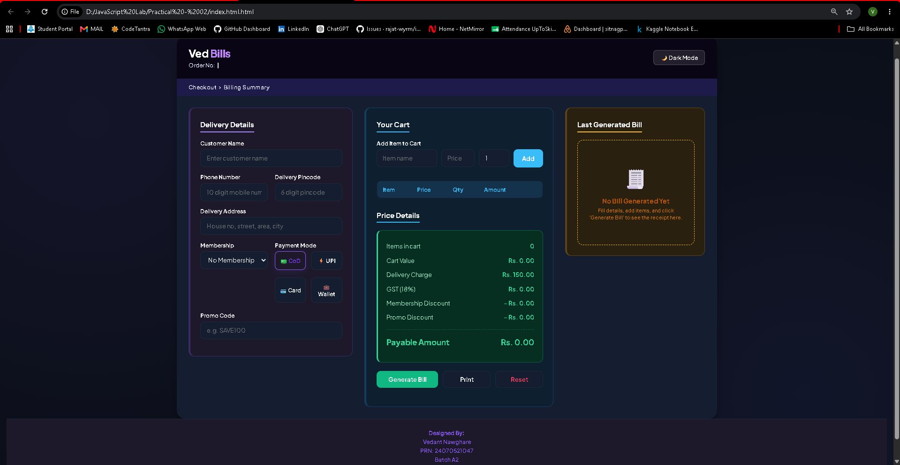
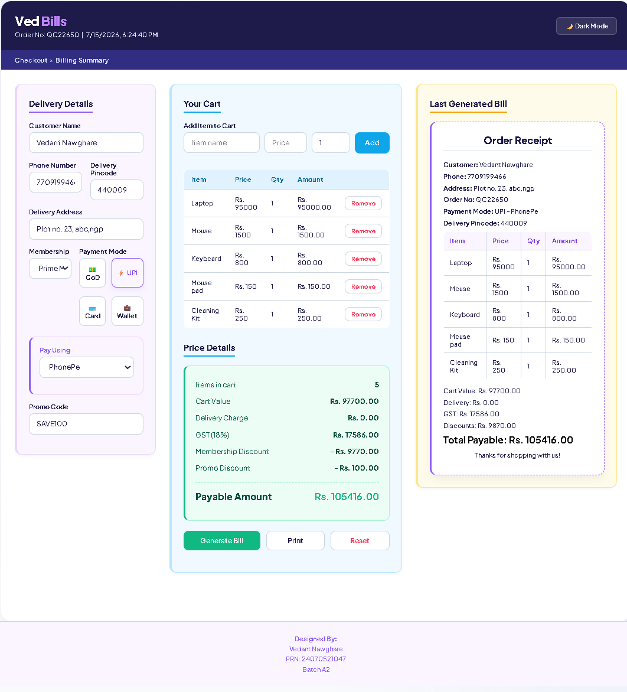

# Practical - 02

**Student Name:** Vedant Nawghare
**PRN:** 24070521047

**File Path:** `Practical-02/index.html` | `Practical-02/style.css` | `Practical-02/script.js`

---

# Experiment Title

Use `var`, `let`, `const`, and demonstrate basic JavaScript features such as Template Literals and Destructuring by developing a Billing Calculator with User Input.

---

# Software / Tools Required

- Visual Studio Code
- Google Chrome / Any Modern Web Browser
- HTML5
- CSS3
- JavaScript (ES6)

---

# Experiment Program Code

The complete implementation of this experiment is available in the following files:

- `index.html`
- `style.css`
- `script.js`

### Concepts Demonstrated

- Variable Declarations using `var`, `let`, and `const`
- Template Literals
- Object Destructuring
- DOM Manipulation
- User Input Handling
- Dynamic Bill Generation
- Arithmetic Operations
- Event Handling

---

# Case Study Title

Online Shopping Billing Calculator using Modern JavaScript (ES6)

---

# Case Study Program Code

The case study has been implemented using the same project files:

- `index.html`
- `style.css`
- `script.js`

### JavaScript Features Used

| Feature | Purpose |
|----------|---------|
| `var` | Declares variables with function scope for storing billing data. |
| `let` | Declares block-scoped variables whose values change during execution. |
| `const` | Stores constant values such as GST rate and calculated totals. |
| Template Literals | Generates dynamic HTML content and formatted invoices. |
| Object Destructuring | Extracts object properties for cleaner and more readable code. |
| DOM Manipulation | Dynamically updates the billing information on the webpage. |

### Case Study Features

- Product listing
- Customer information form
- Automatic bill generation
- GST calculation
- Grand total calculation
- Dynamic invoice generation
- Interactive shopping interface

---

# Output

Screenshots attached in the repo folder.

# Result / Conclusion

The experiment was successfully performed to demonstrate the usage of modern JavaScript features including `var`, `let`, `const`, Template Literals, and Object Destructuring. A dynamic billing calculator was developed that accepts customer input, calculates the subtotal, GST, and grand total, and generates a formatted invoice, demonstrating the practical application of ES6 features in interactive web development.
