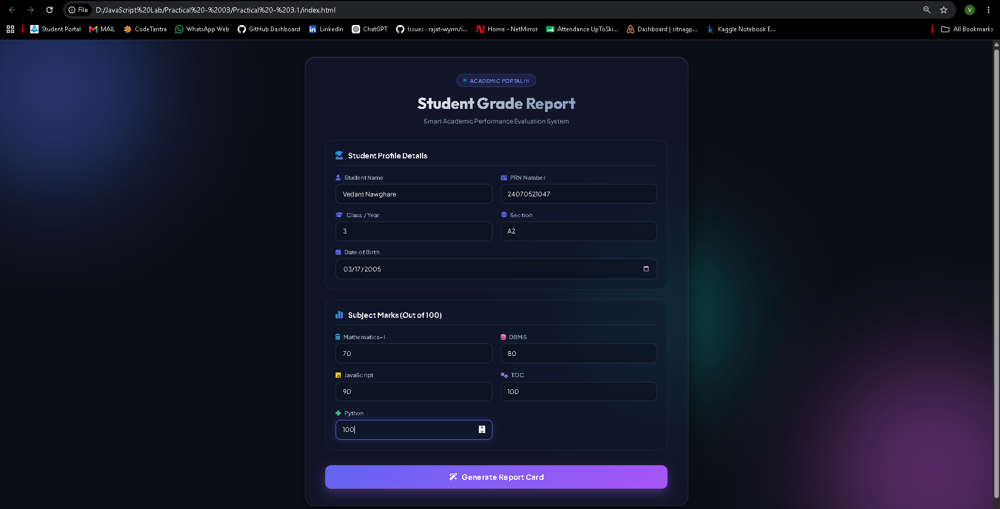
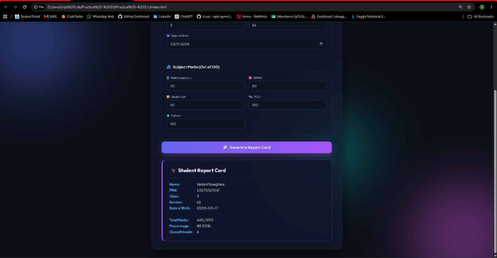

# Practical - 03.1

**Student Name:** Vedant Nawghare
**PRN:** 24070521047

**File Path:** `Practical-03.1/index.html` | `Practical-03.1/style.css` | `Practical-03.1/script.js`

---

# Experiment Title

Implement Control Structures and Form Validation; Create a Grading System Based on User-Entered Marks.

---

# Software / Tools Required

- Visual Studio Code
- Google Chrome / Any Modern Web Browser
- HTML5
- CSS3
- JavaScript (ES6)

---

# Experiment Program Code

The complete implementation of this experiment is available in the following files:

- `index.html`
- `style.css`
- `script.js`

### Concepts Demonstrated

- Control Structures (`if`, `else if`, `else`)
- Form Validation
- User Input Handling
- Conditional Logic
- DOM Manipulation
- Event Handling

---

# Output

Screenshots attached in the repo folder.

---

# Result / Conclusion

The experiment was successfully performed to demonstrate JavaScript control structures and form validation techniques. A grading system was developed that validates user-entered marks, calculates grades using conditional statements, determines the pass/fail status, and dynamically displays the student's result. The experiment provided practical knowledge of implementing decision-making logic and interactive form validation using JavaScript.
