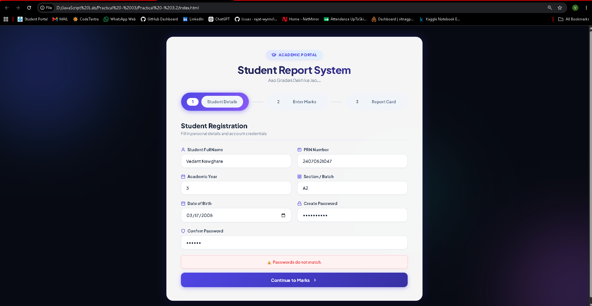
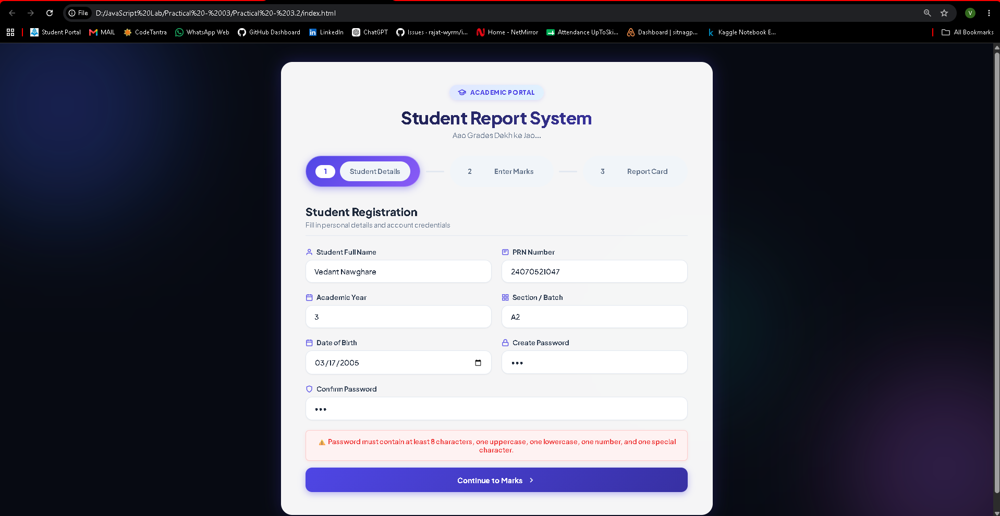
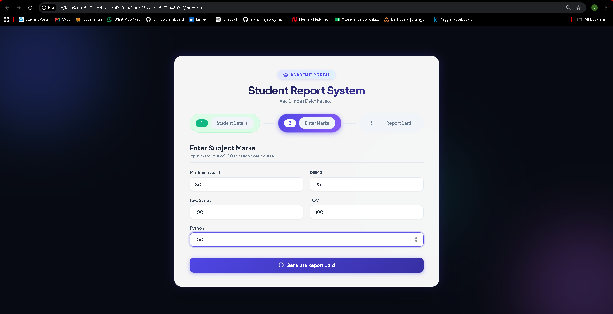
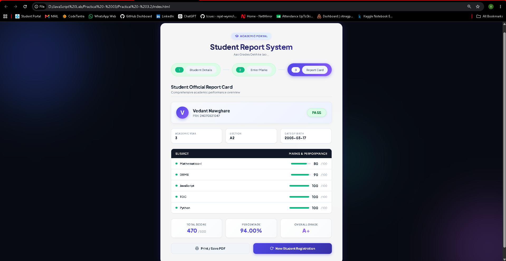

# Practical - 03.2

**Student Name:** Vedant Nawghare
**PRN:** 24070521047

**File Path:** `Practical-03.2/index.html` | `Practical-03.2/style.css` | `Practical-03.2/script.js`

---

# Case Study Title

Student Registration and Result Management System using JavaScript Form Validation

---

# Software / Tools Required

- Visual Studio Code
- Google Chrome / Any Modern Web Browser
- HTML5
- CSS3
- JavaScript (ES6)

---

# Case Study Program Code

The complete implementation of this case study is available in the following files:

- `index.html`
- `style.css`
- `script.js`

### JavaScript Features Used

| Feature | Purpose |
|----------|---------|
| Form Validation | Validates all student information before processing. |
| Password Validation | Ensures Password and Confirm Password fields match and satisfy validation rules. |
| Control Structures | Calculates grades and determines pass/fail status. |
| DOM Manipulation | Dynamically displays student details and results. |
| Event Handling | Handles user interactions and form submission. |

### Case Study Features

- Student registration form
- Name, Roll Number, Age and Mobile Number validation
- Password and Confirm Password validation
- Marks entry
- Automatic grade calculation
- Pass/Fail determination
- Dynamic student result generation
- Interactive validation messages

---

# Output

### Student Registration

### Password Validation

### Marks Entry

### Final Student Result

Screenshots attached in the repo folder.

---

# Result / Conclusion

The case study was successfully implemented to demonstrate JavaScript form validation, password verification, and control structures. The application accepts student information, validates all required fields, verifies the password and confirm password entries, accepts marks, calculates the appropriate grade and pass/fail status, and dynamically displays the final student result. This case study demonstrates the practical application of JavaScript in developing secure, interactive, and user-friendly web applications.
