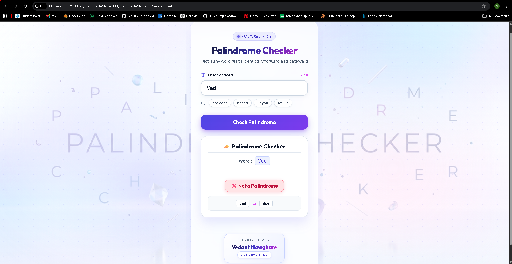
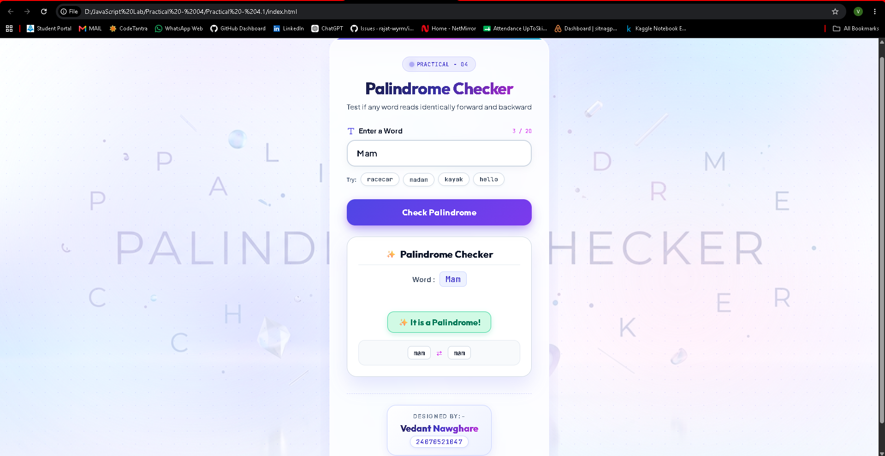

# Practical - 04.1

**Student Name:** Vedant Nawghare
**PRN:** 24070521047

**File Path:** `Practical-04.1/index.html` | `Practical-04.1/style.css` | `Practical-04.1/script.js`

---

# Experiment Title

Use Function Types, Scope, and Closures; Apply Try-Catch Exception Handling; Build a Palindrome Checker.

---

# Software / Tools Required

- Visual Studio Code
- Google Chrome / Any Modern Web Browser
- HTML5
- CSS3
- JavaScript (ES6)

---

# Experiment Program Code

The complete implementation of this experiment is available in the following files:

- `index.html`
- `style.css`
- `script.js`

### Concepts Demonstrated

- Function Declaration
- Function Expression
- Arrow Functions
- Variable Scope
- Closures
- Exception Handling using `try-catch`
- String Manipulation
- DOM Manipulation
- User Input Validation

---

# Output

Screenshots attached in the repo folder.

---

# Result / Conclusion

The experiment was successfully performed to demonstrate different JavaScript function types, variable scope, closures, and exception handling using `try-catch`. A palindrome checker was developed that accepts user input, validates it, removes unnecessary characters, and determines whether the entered word or phrase is a palindrome. The experiment provided practical understanding of reusable functions, closures, scope management, string manipulation, and exception handling in JavaScript.
