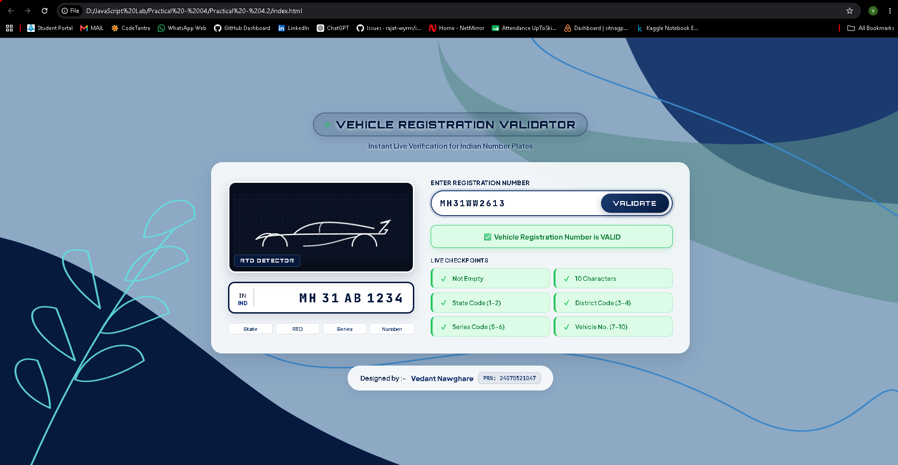
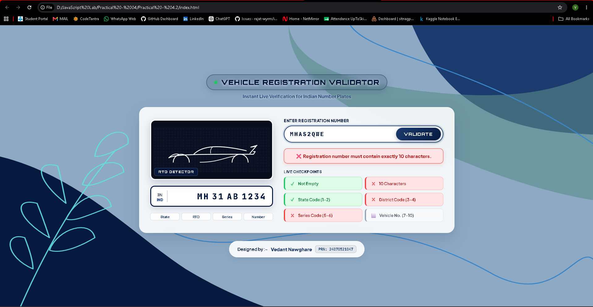

# Practical - 04.2

**Student Name:** Vedant Nawghare
**PRN:** 24070521047

**File Path:** `Practical-04.2/index.html` | `Practical-04.2/style.css` | `Practical-04.2/script.js`

---

# Case Study Title

Vehicle Registration Number Validation using JavaScript Functions and Exception Handling

---

# Software / Tools Required

- Visual Studio Code
- Google Chrome / Any Modern Web Browser
- HTML5
- CSS3
- JavaScript (ES6)

---

# Case Study Program Code

The complete implementation of this case study is available in the following files:

- `index.html`
- `style.css`
- `script.js`

### JavaScript Features Used

| Feature | Purpose |
|----------|---------|
| Function Declaration | Creates reusable validation functions. |
| Function Expression | Implements dynamic functionality for processing user input. |
| Arrow Functions | Provides concise syntax for helper functions. |
| Variable Scope | Demonstrates global, function, and block-level scope. |
| Closures | Preserves variable values between function executions where required. |
| Try-Catch | Handles invalid registration numbers and runtime errors gracefully. |
| DOM Manipulation | Dynamically updates validation results on the webpage. |

### Case Study Features

- Vehicle registration number input
- Automatic uppercase conversion
- Live character counter
- Rule-based registration validation
- Input format verification
- Dynamic success and error messages
- Exception handling for invalid inputs

---

# Output

Screenshots attached in the repo folder.

---

# Result / Conclusion

The case study was successfully implemented to demonstrate the practical use of JavaScript functions, variable scope, closures, and exception handling. A vehicle registration number validation system was developed to verify user-entered registration numbers based on predefined formatting rules. The application validates each component of the registration number, provides meaningful feedback for invalid inputs, and dynamically displays validation results, demonstrating effective input validation and error handling techniques in modern JavaScript.
