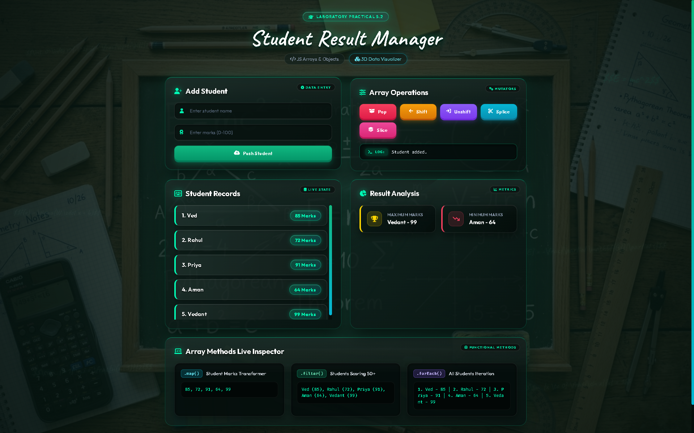

# Practical 5.2

## Experiment Title

Implement JavaScript Arrays and Array Methods such as `push()`, `pop()`, `shift()`, `unshift()`, `splice()`, `slice()`, `map()`, `filter()`, and `forEach()` by developing a Student Result Manager.

## Student Details

- **Name:** Vedant Nawghare
- **PRN:** 24070521047

## Software / Tools Required

- Visual Studio Code
- Google Chrome / Any Modern Web Browser
- HTML5
- CSS3
- JavaScript (ES6)

## Aim

To understand and implement JavaScript arrays, objects, array manipulation methods, and functional array methods for managing and analyzing student result data dynamically.

## Concepts Used

- JavaScript Arrays
- Array of Objects
- `push()`
- `pop()`
- `shift()`
- `unshift()`
- `splice()`
- `slice()`
- `map()`
- `filter()`
- `forEach()`
- Conditional Statements
- DOM Manipulation
- User Input Handling

## Case Study

### Student Result Manager

A Student Result Manager is developed using JavaScript arrays and objects. The application allows users to add and remove students, perform different array operations, and analyze student marks dynamically.

## Features

- Add new students with their marks
- Display student records dynamically
- Remove the last student using `pop()`
- Remove the first student using `shift()`
- Add a student at the beginning using `unshift()`
- Remove a student using `splice()`
- Extract students using `slice()`
- Find maximum marks
- Find minimum marks
- Display marks using `map()`
- Filter students scoring 50 or above using `filter()`
- Iterate through all students using `forEach()`
- Validate student name and marks
- Display operation messages dynamically

## JavaScript Array Methods Used

| Method | Purpose |
|---|---|
| `push()` | Adds a new student to the end of the array. |
| `pop()` | Removes the last student from the array. |
| `shift()` | Removes the first student from the array. |
| `unshift()` | Adds a new student at the beginning of the array. |
| `splice()` | Adds or removes elements at a specific position. |
| `slice()` | Creates a portion of the student array without modifying the original array. |
| `map()` | Extracts student marks into a new array. |
| `filter()` | Finds students who scored 50 or above. |
| `forEach()` | Iterates through all students and displays their information. |

## File Structure

```text
Practical-05/
└── Practical-5.2/
    ├── index.html
    ├── script.js
    ├── style.css
    └── chalkboard_bg.jpg
````

## Output

The output of the program is shown below:



## Result

The Student Result Manager was successfully implemented using JavaScript arrays, objects, and array methods. The practical demonstrates how different array manipulation and functional methods can be used to manage and analyze student data dynamically.

## Conclusion

This practical provided an understanding of JavaScript arrays and various array methods. The Student Result Manager demonstrated practical applications of methods such as `push()`, `pop()`, `shift()`, `unshift()`, `splice()`, `slice()`, `map()`, `filter()`, and `forEach()` for data manipulation and result analysis.
