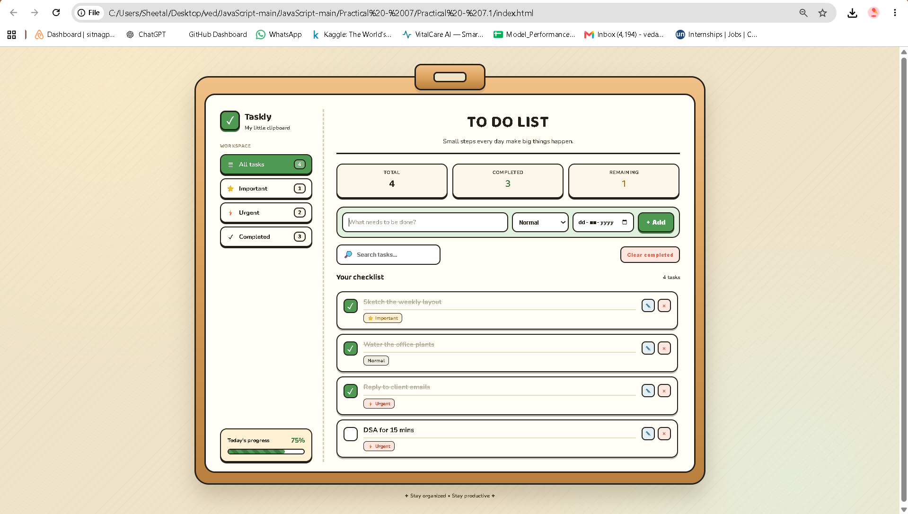
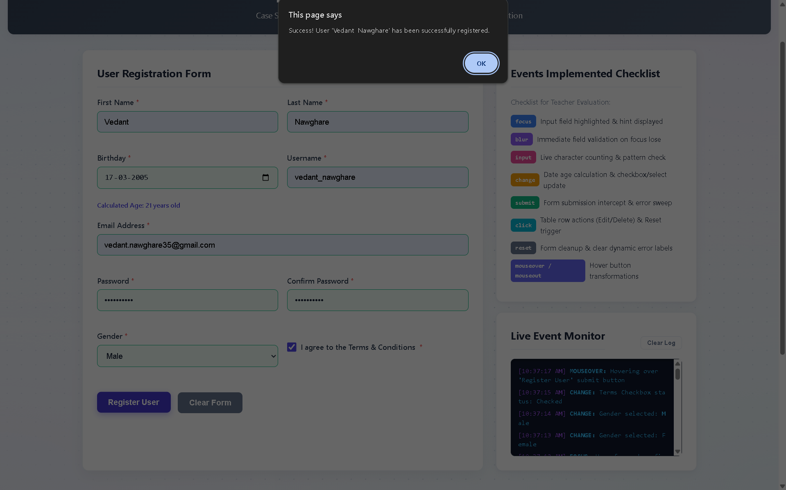

# Practical 7.1

## Experiment Title

Implement JavaScript Event Handling and Form Validation by developing an Interactive User Registration Form with DOM Manipulation and Event Logging.

## Student Details

- **Name:** Vedant Nawghare
- **PRN:** 24070521047

## Software / Tools Required

- Visual Studio Code
- Google Chrome / Any Modern Web Browser
- HTML5
- CSS3
- JavaScript (ES6)

## Aim

To understand and implement JavaScript event handling, form validation, DOM manipulation, event logging, and dynamic table operations using various JavaScript events.

## Concepts Used

- JavaScript Event Handling
- Form Validation
- DOM Manipulation
- DOM Traversal
- `addEventListener()`
- `focus` Event
- `blur` Event
- `input` Event
- `change` Event
- `submit` Event
- `click` Event
- `reset` Event
- `mouseover` Event
- `mouseout` Event
- Regular Expressions
- Conditional Statements
- Dynamic HTML Elements
- User Input Handling
- Dynamic Table Creation

## Case Study

### Interactive User Registration and Event Monitoring System

An interactive User Registration Form is developed using HTML, CSS, and JavaScript. The application validates user details such as name, username, email, birthday, password, gender, and terms and conditions.

Different JavaScript events are used to monitor user interactions. After successful registration, the user details are dynamically added to a table where records can be edited or deleted using DOM manipulation and traversal.

## Features

- User registration form
- First name and last name validation
- Birthday and age validation
- Username validation
- Email validation
- Password validation
- Confirm password matching
- Gender selection validation
- Terms and conditions validation
- Real-time input validation
- Live event monitoring console
- Event logging for user interactions
- Dynamic registered users table
- Edit user records
- Delete user records
- Dynamic record count
- Reset form functionality
- Clear event log functionality
- Mouse hover event tracking

## JavaScript Events Used

| Event | Purpose |
|---|---|
| `focus` | Detects when the user focuses on an input field. |
| `blur` | Validates the field when the user moves away from it. |
| `input` | Performs live validation while the user enters data. |
| `change` | Detects changes in date, gender, and checkbox values. |
| `submit` | Validates the complete form before registering the user. |
| `click` | Handles edit, delete, clear log, and other button actions. |
| `reset` | Clears validation states and dynamic error messages. |
| `mouseover` | Detects when the mouse moves over the register button. |
| `mouseout` | Detects when the mouse leaves the register button. |

## Validation Methods Used

| Validation | Purpose |
|---|---|
| First Name Validation | Checks whether the first name is entered correctly. |
| Last Name Validation | Checks whether the last name is entered correctly. |
| Birthday Validation | Checks the selected date and calculates the user's age. |
| Username Validation | Allows alphanumeric characters and underscores with a valid length. |
| Email Validation | Checks whether the entered email follows a valid format. |
| Password Validation | Checks the minimum password length. |
| Confirm Password | Checks whether both passwords match. |
| Gender Validation | Ensures that a gender option is selected. |
| Terms Validation | Ensures that the Terms & Conditions checkbox is selected. |

## DOM Manipulation Used

- `document.getElementById()`
- `document.createElement()`
- `querySelector()`
- `querySelectorAll()`
- `appendChild()`
- `remove()`
- `parentElement`
- `children`
- `innerHTML`
- `textContent`
- `classList`
- Dynamic table row creation
- DOM traversal for Edit and Delete operations

## File Structure

```text
Practical-07/
└── Practical-7.1/
    ├── index.html
    ├── script.js
    └── style.css
````

## Output

The output of the program is shown below:





## Result

The Interactive User Registration and Event Monitoring System was successfully implemented using JavaScript event handling, form validation, and DOM manipulation. The application successfully validates user inputs, logs different events, and dynamically manages registered user records.

## Conclusion

This practical provided an understanding of JavaScript event handling and form validation. Various events such as `focus`, `blur`, `input`, `change`, `submit`, `click`, `reset`, `mouseover`, and `mouseout` were implemented. DOM manipulation and traversal were also used to dynamically create, edit, and delete user records from the registration table.
