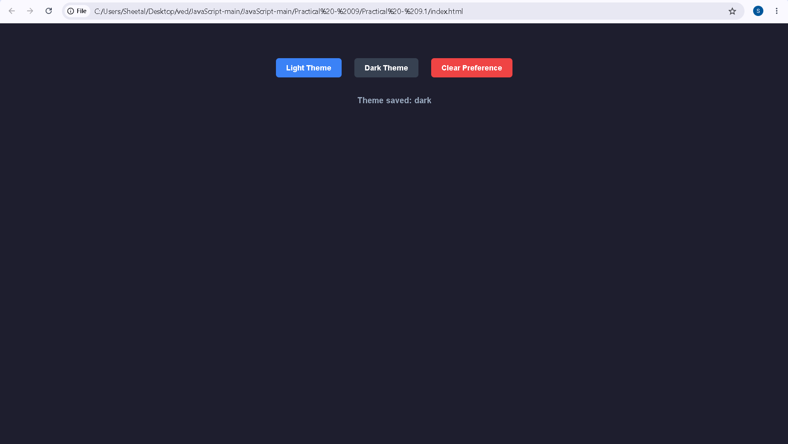

# Practical - 9.1

**Student Name:** Vedant Nawghare  
**PRN:** 24070521047  

**File Path:** `Practical-9.1/index.html`

---

# Experiment Title

Implement Browser Storage using `localStorage` and `sessionStorage` to Save and Manage User Theme Preferences.

---

# Software / Tools Required

- Visual Studio Code
- Google Chrome / Any Modern Web Browser
- HTML5
- CSS3
- JavaScript (ES6)

---

# Experiment Program Code

The complete implementation of this experiment is available in the following file:

- `index.html`

### Concepts Demonstrated

- `localStorage`
- `sessionStorage`
- Browser Storage
- DOM Manipulation
- JavaScript Functions
- Event Handling
- CSS Classes
- Page Load Events
- Conditional Statements

---

# Case Study Title

Theme Preference Management using Browser Storage

---

# Case Study Program Code

The case study demonstrates how browser storage can be used to save a user's theme preference and restore it when the webpage is opened again.

### JavaScript Features Used

| Feature | Purpose |
|----------|---------|
| `localStorage.setItem()` | Saves the selected theme permanently in browser storage. |
| `localStorage.getItem()` | Retrieves the saved theme preference. |
| `localStorage.removeItem()` | Removes the saved theme preference. |
| `sessionStorage.setItem()` | Stores the current theme for the active browser session. |
| `sessionStorage.removeItem()` | Removes the current session theme. |
| `classList.add()` | Applies the dark theme CSS class. |
| `classList.remove()` | Removes the dark theme CSS class. |
| `getElementById()` | Selects the message element from the webpage. |
| `window.onload` | Loads the saved theme when the webpage opens. |

### Case Study Features

- Light Theme button
- Dark Theme button
- Clear Preference button
- Saves selected theme using `localStorage`
- Stores current session theme using `sessionStorage`
- Automatically loads saved theme on page opening
- Displays the current theme status
- Clears stored theme preference

### Storage Used

| Storage | Purpose |
|----------|---------|
| `localStorage` | Stores the selected theme so that it can be retrieved when the page is opened again. |
| `sessionStorage` | Stores the current theme for the active browser session. |

---

# Output

Screenshots attached in the repo folder.

# Result / Conclusion

The experiment was successfully performed to demonstrate the use of `localStorage` and `sessionStorage` in JavaScript. A theme preference webpage was developed where users can select Light or Dark Theme, save their preference, restore it when the page loads, and clear the stored preference using browser storage.
