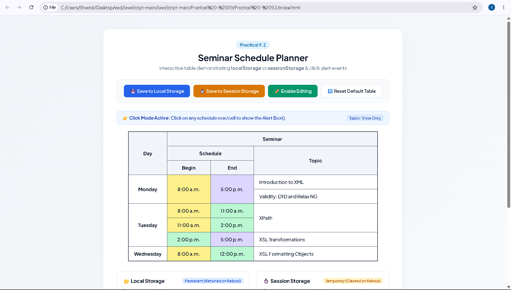
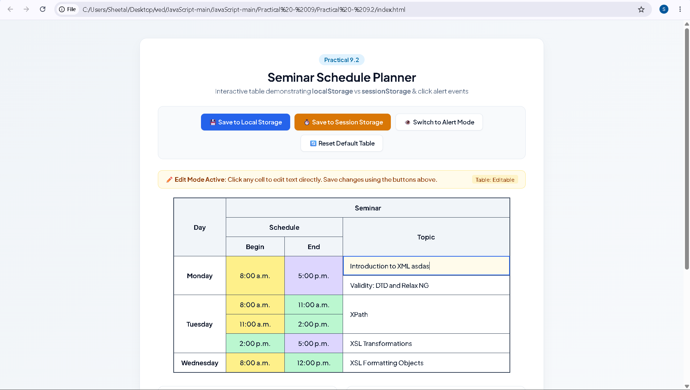
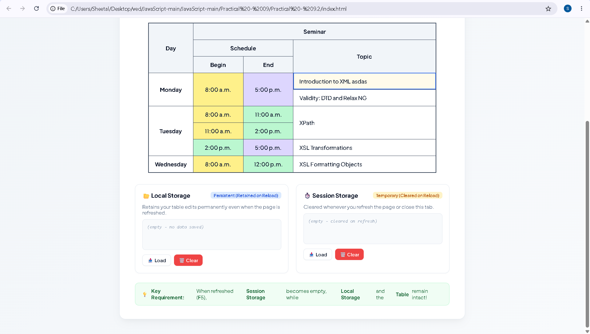

# Practical - 9.2

**Student Name:** Vedant Nawghare  
**PRN:** 24070521047  

**File Path:** `Practical - 09/Practical - 9.2/index.html`

---

# Experiment Title

Demonstrate Local Storage and Session Storage by Developing an Interactive Seminar Schedule Planner.

---

# Software / Tools Required

- Visual Studio Code
- Google Chrome / Any Modern Web Browser
- HTML5
- CSS3
- JavaScript (ES6)

---

# Experiment Program Code

The complete implementation of this experiment is available in the following file:

- `index.html`

### Concepts Demonstrated

- `localStorage`
- `sessionStorage`
- DOM Manipulation
- Event Handling
- Dynamic HTML Content
- `contenteditable`
- JavaScript Functions
- Alert Boxes
- Browser Storage Management

---

# Case Study Title

Interactive Seminar Schedule Planner using Browser Storage

---

# Case Study Program Code

The case study implements an interactive seminar schedule where users can view, edit, save, load, and reset the schedule using JavaScript and browser storage.

### JavaScript Features Used

| Feature | Purpose |
|----------|---------|
| `localStorage.setItem()` | Saves the edited schedule permanently. |
| `localStorage.getItem()` | Retrieves the saved schedule. |
| `localStorage.removeItem()` | Removes the saved local data. |
| `sessionStorage.setItem()` | Saves the schedule temporarily for the current session. |
| `sessionStorage.getItem()` | Retrieves the session data. |
| `sessionStorage.removeItem()` | Removes the saved session data. |
| `querySelectorAll()` | Selects schedule rows and table cells. |
| `setAttribute()` | Enables editable table cells. |
| `removeAttribute()` | Disables editing mode. |
| `innerHTML` | Updates and stores the schedule table. |
| `alert()` | Displays schedule and storage messages. |

### Case Study Features

- Interactive seminar schedule table
- Clickable schedule rows
- Alert box displaying seminar details
- Edit mode for modifying table cells
- Local Storage for permanent data
- Session Storage for temporary data
- Load data from Local Storage
- Load data from Session Storage
- Clear Local Storage
- Clear Session Storage
- Reset schedule to default
- Real-time storage status display

### Storage Used

| Storage | Purpose |
|----------|---------|
| `localStorage` | Stores the edited seminar schedule so that it remains available after page reload. |
| `sessionStorage` | Stores the seminar schedule temporarily during the current browser session. |

### Working Modes

- **Click Mode:** Clicking a schedule row displays an alert containing the day, topic, and clicked cell.
- **Edit Mode:** Schedule cells become editable using the `contenteditable` attribute.
- **Local Storage:** Saves schedule changes permanently.
- **Session Storage:** Saves schedule changes temporarily.

---

# Output

Screenshots attached in the repo folder.

---

# Result / Conclusion

The experiment was successfully performed to demonstrate the use of `localStorage` and `sessionStorage` in JavaScript. An interactive seminar schedule planner was developed that allows users to view, edit, save, load, clear, and reset schedule data. The practical demonstrates browser storage, DOM manipulation, event handling, editable table cells, and JavaScript alert boxes.
