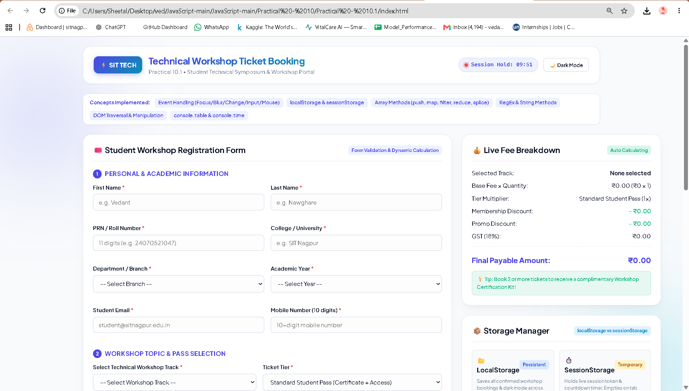
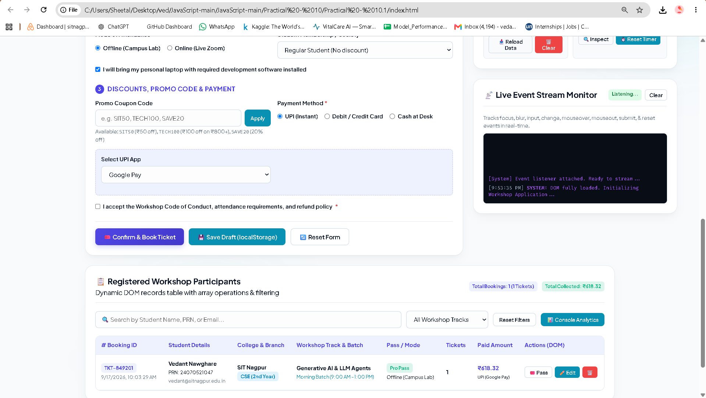

# Practical - 10.1

**Student Name:** Vedant Nawghare  
**PRN:** 24070521047  

**File Path:** `Practical - 10/Practical - 10.1/index.html` | `Practical - 10/Practical - 10.1/style.css` | `Practical - 10/Practical - 10.1/script.js`

---

# Experiment Title

Develop a Technical Workshop Ticket Booking System using JavaScript Form Validation, Regular Expressions, Array Methods, DOM Manipulation, Event Handling, and Web Storage.

---

# Software / Tools Required

- Visual Studio Code
- Google Chrome / Any Modern Web Browser
- HTML5
- CSS3
- JavaScript (ES6)

---

# Experiment Program Code

The complete implementation of this experiment is available in the following files:

- `index.html`
- `style.css`
- `script.js`

### Concepts Demonstrated

- Form Validation
- Regular Expressions
- JavaScript Arrays and Objects
- Array Methods
- String Methods
- DOM Manipulation
- DOM Traversal
- Event Handling
- Dynamic Billing Calculation
- `localStorage`
- `sessionStorage`
- Console Methods
- Conditional UPI Payment Fields

---

# Case Study Title

Technical Workshop Ticket Booking System

---

# Case Study Program Code

The case study implements a student technical workshop registration and ticket booking system with form validation, dynamic billing, payment options, storage, and booking records.

### JavaScript Features Used

| Feature | Purpose |
|----------|---------|
| Form Validation | Validates student and workshop registration details. |
| Regular Expressions | Validates names, PRN, email, phone number, and UPI ID. |
| `push()` | Adds new booking records to the bookings array. |
| `map()` | Updates booking data dynamically. |
| `filter()` | Filters booking records. |
| `reduce()` | Calculates total revenue and billing values. |
| `splice()` | Removes booking records when required. |
| `localStorage` | Stores bookings, drafts, and theme preferences. |
| `sessionStorage` | Maintains the temporary session ticket hold. |
| DOM Manipulation | Dynamically updates forms, billing details, records, and messages. |
| Event Handling | Handles focus, blur, input, change, mouse, submit, and reset events. |
| `console.table()` | Displays booking data in the browser console. |
| `console.time()` | Measures application initialization time. |

### Case Study Features

- Student registration form
- Personal and academic information
- Workshop track selection
- Ticket tier selection
- Batch timing selection
- Ticket quantity selection
- Membership-based discount
- Laptop/add-on selection
- Promo code support
- UPI payment option
- Conditional UPI ID field
- 18% GST calculation
- Dynamic billing summary
- Form validation using Regular Expressions
- Live event console
- Booking records table
- Search and category filtering
- Local Storage for saved bookings and drafts
- Session Storage for temporary ticket hold
- Dark / Light theme
- Printable booking receipt

### Form Validation

The application validates:

- First Name
- Last Name
- Student PRN
- College / University
- Department
- Academic Year
- Email
- Mobile Number
- Workshop Track
- Pass Tier
- Batch Timing
- Ticket Quantity
- UPI ID when required
- Terms and Conditions

### Billing Calculation

The application dynamically calculates the final ticket amount using:

- Workshop base price
- Selected pass tier
- Ticket quantity
- Membership discount
- Promo code discount
- GST

The final amount is displayed in the billing summary before booking confirmation.

---

# Output

Screenshots attached in the repo folder.

---

# Result / Conclusion

The experiment was successfully performed to develop a Technical Workshop Ticket Booking System using JavaScript. The application demonstrates form validation using Regular Expressions, array methods, DOM manipulation, event handling, dynamic billing calculations, localStorage, sessionStorage, and console methods. The system successfully provides an interactive registration and ticket booking experience with validation, payment options, booking records, and storage management.
