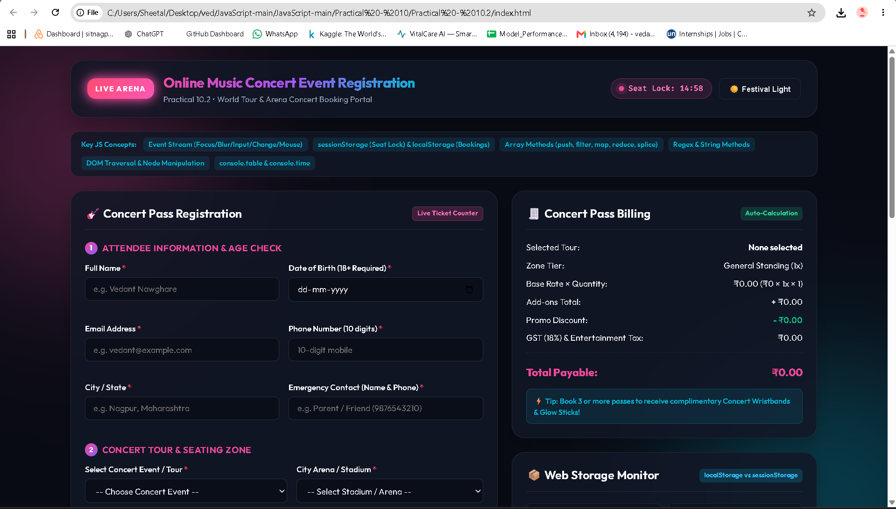
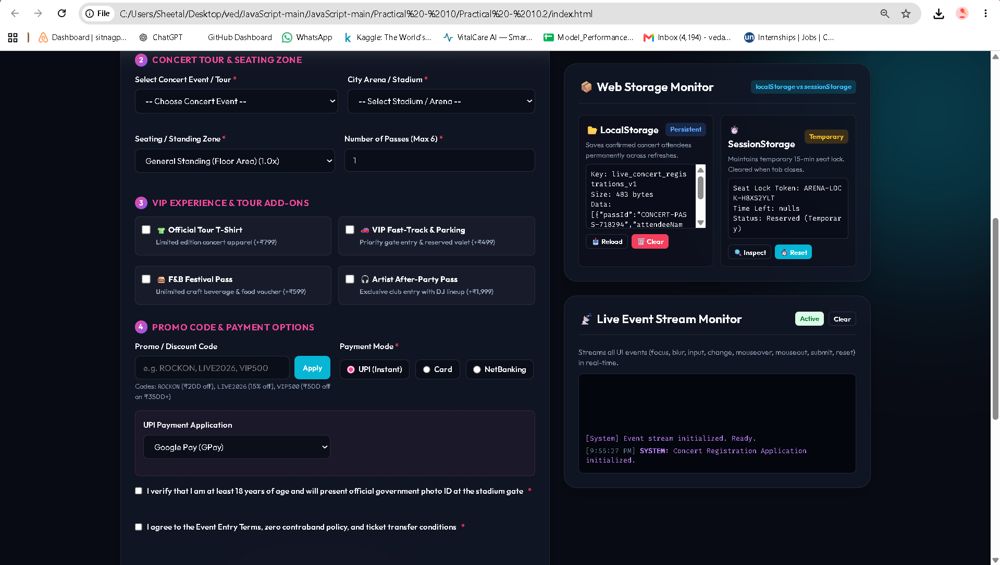

# Practical - 10.2 
 
**Student Name:** Vedant Nawghare 
**PRN:** 24070521047 
 
**File Path:** `Practical - 10/Practical - 10.2/index.html` | `Practical - 10/Practical - 10.2/style.css` | `Practical - 10/Practical - 10.2/script.js` 
 
--- 
 
# Experiment Title 
 
**Online Music Concert Event Registration System** 
 
This practical implements an online concert registration and ticket booking system using HTML, CSS and JavaScript. The system includes form validation, dynamic billing, seat locking, storage management, event handling and concert pass registration.
 
--- 
 
# Software / Tools Required 
 
- Visual Studio Code 
- Google Chrome / Any Modern Web Browser 
- HTML5 
- CSS3 
- JavaScript (ES6) 
 
--- 
 
# Experiment Program Code 
 
The complete implementation of this experiment is available in the following files: 
 
- `index.html` 
- `style.css` 
- `script.js` 
 
### Concepts Demonstrated 
 
- Form validation using JavaScript and Regular Expressions
- Event handling using focus, blur, input, change, mouseover, mouseout, submit and reset
- Dynamic billing calculation
- Arrays of objects and array methods
- `localStorage` and `sessionStorage`
- Dynamic age calculation
- Promo code and discount handling
- Conditional UPI payment options
- DOM manipulation and traversal
- Live event console feed
- Live search and category filtering
- Dynamic counters and empty-state handling
- `console.table()`, `console.time()` and `console.timeEnd()`
- Printable concert/VIP pass using `window.print()`
 
--- 
 
# Case Study Title 
 
**Online Music Concert Registration and Ticket Booking Portal**
 
The case study allows users to register for a music concert, select a concert tour, venue and seating zone, choose additional services, apply promo codes and calculate the final ticket amount including GST.
 
The system also maintains registered attendees using browser storage and provides a temporary 15-minute seat lock using `sessionStorage`.
 
--- 
 
# Case Study Program Code 
 
The case study has been implemented using the same project files: 
 
- `index.html` 
- `style.css` 
- `script.js` 
 
### JavaScript Features Used 
 
| Feature | Purpose | 
|----------|---------| 
| Arrays of Objects | Store registered concert attendees | 
| `push()` | Add new concert registrations | 
| `map()` | Process registration data | 
| `filter()` | Search and filter registrations | 
| `reduce()` | Calculate totals and sales | 
| `splice()` | Remove registration records | 
| Regular Expressions | Validate name, email, phone and UPI details | 
| `localStorage` | Store registrations, drafts and theme preference | 
| `sessionStorage` | Maintain temporary seat-lock information | 
| DOM Manipulation | Create and update page elements dynamically | 
| Event Listeners | Handle user interactions and form events | 
| Dynamic Billing | Calculate ticket, zone, add-on, discount and GST amounts | 
| `console.table()` | Display registration data in the console | 
| `window.print()` | Print the generated concert/VIP pass | 
 
### Case Study Features 
 
- Attendee registration with personal and contact details
- 18+ age verification using Date of Birth
- Concert tour and venue selection
- Seating zone selection with different price multipliers
- Pass quantity selection from 1 to 6
- Concert merchandise and VIP add-ons
- Promo/discount code support
- Multiple payment options including UPI
- Custom UPI VPA validation
- Dynamic ticket billing with 18% GST
- 15-minute temporary seat lock
- Persistent registration storage using `localStorage`
- Draft restoration
- Live event monitoring console
- Registration search and filtering
- Theme switching
- Concert registration table and counters
- Printable VIP/concert pass
 
--- 
 
# Output 
 
 
 
 
Screenshots attached in the repo folder. 
 
# Result / Conclusion 
 
The Online Music Concert Event Registration System was successfully implemented using HTML, CSS and JavaScript. The practical demonstrates form validation, event handling, array methods, DOM manipulation, browser storage, dynamic billing, filtering and temporary seat locking in a real-world concert booking scenario.
